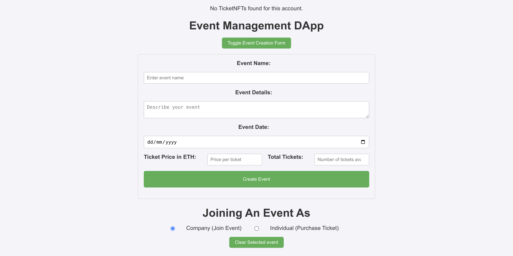
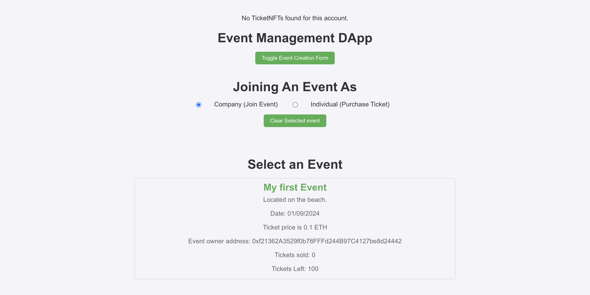
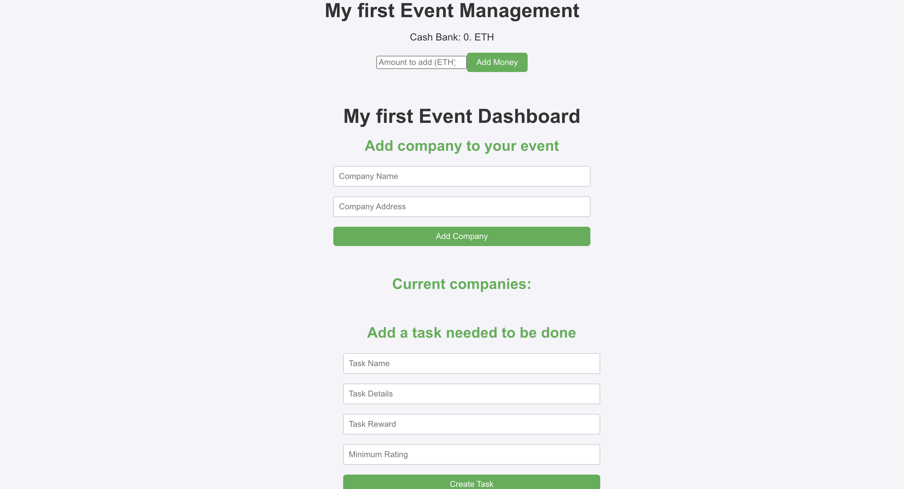
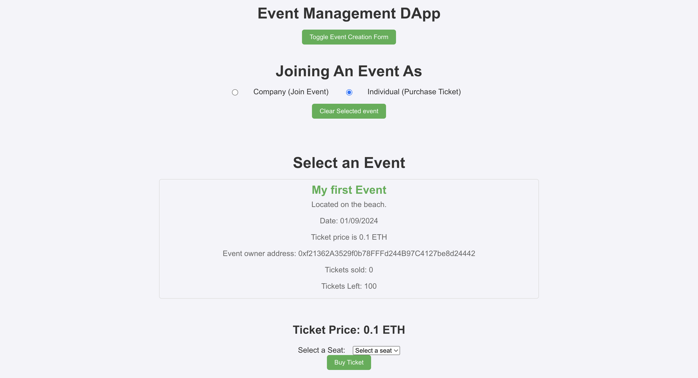
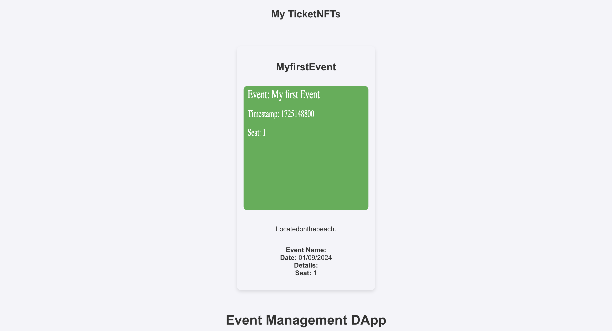
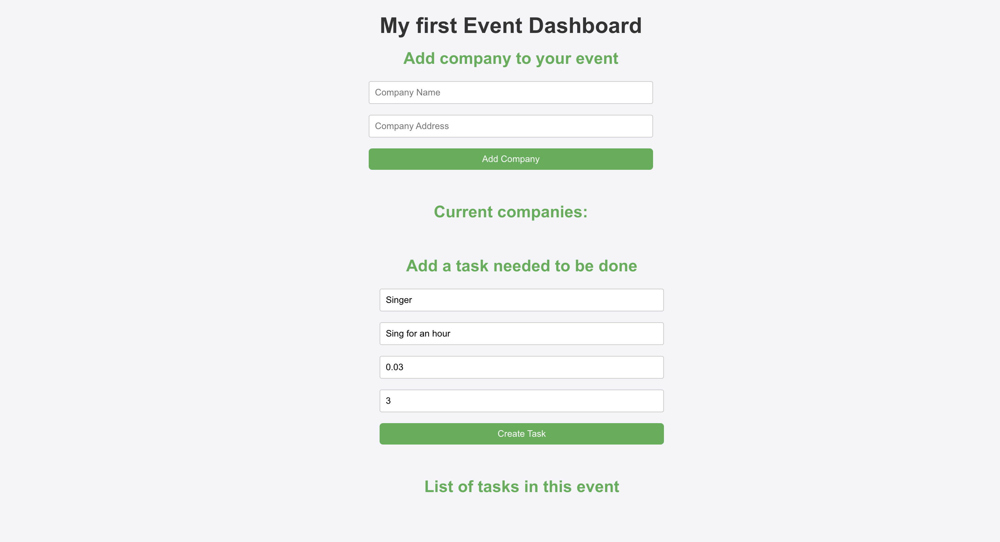
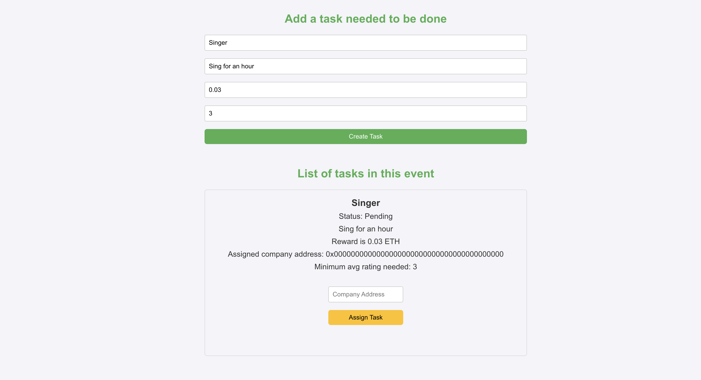

# EventCoin

EventCoin is a decentralized application (dApp) for managing events using NFTs as digital tickets. This project includes smart contracts, a front-end interface, and integration with MetaMask for blockchain transactions.


## Features

### 1. NFT Integration
- Utilizes NFTs as unique event tickets, each with attributes like event details or seat number, providing a secure and verifiable way to manage event access.

### 2. Manager Contract
- The event organizer's contract handles rewards for completing tasks, ensuring transparency and automation in the reward distribution process.
- 
### 3. Unique Rating System
- Tasks are only rewarded if their average rating meets a predefined threshold. This prevents cheating and ensures that only tasks with high-quality completion are rewarded.


## Purpose

### 1. Create Events
- **Create Events**: Organizers can create and manage events, setting details such as task deadlines and budget.
  
### 2. Manage Companies
- **Manage Companies**: Companies can join the contract as service providers, receive tasks, and complete them.
  
### 3. Manage Tasks
- **Manage Tasks**: Organizers create tasks that companies can take on and complete.
  
### 4. Purchase NFT Tickets
- **Purchase NFT Tickets**: Participants can buy unique NFTs that serve as tickets for event entry.
  
### 5. Reward Distribution
- **Reward Distribution**: Companies receive rewards based on their performance and the average rating of their completed tasks.


## Screenshots

<p align="center">
    
</p>
<p align="center">
    
</p>
<p align="center">
    
</p>
<p align="center">
    
</p>
<p align="center">
    
</p>
<p align="center">
    
</p>
<p align="center">
    
</p>


## Requirements

- [Truffle](https://www.trufflesuite.com/truffle)
- [Ganache](https://www.trufflesuite.com/ganache)
- [Node.js](https://nodejs.org/)
- [MetaMask](https://metamask.io/)


## Installation

### 1. Download the Files

Clone the repository to your local machine:

```bash
git clone https://github.com/Itay-Biton/EventCoin.git
cd EventCoin
```

### 2. Ganache Setup

1. Open Ganache.
2. Create a new workspace.
3. Add the project to Ganache by selecting the `truffle-config.js` file.
4. Change the network port to `8888`.

### 3. Visual Studio Code Setup

1. Open the project in Visual Studio Code.
2. Remove the `./client/src/contracts` folder.
3. Run `truffle compile` to compile the smart contracts.
4. Run `truffle migrate` to deploy the contracts to the local blockchain.
5. Move the `./build/contracts` folder to `./client/src/contracts`.
6. Run `npm start` to start the application.

### 4. MetaMask Setup

1. Open MetaMask and add a new network.
2. Enter the Ganache RPC URL: `http://127.0.0.1:8888`.
3. Set the network ID to `1337`.
4. Set the coin symbol to `ETH`.
5. Import the wallet using the private key from Ganache.

### Usage

After completing the installation steps, you can start managing events and purchasing tickets through the dApp interface.


## Contact

If you have any questions or feedback, don't hesitate to get in touch via [email](mailto:itaybit10@gmail.com).


## License and Copyright

© 2024 Itay Biton. All rights reserved.

This project is owned by Itay Biton. Any unauthorized reproduction, modification, distribution, or use of this project, in whole or in part, is strictly prohibited without explicit permission from the author.

For academic purposes or personal review, please ensure proper credit is given to Itay Biton, and include a link to the original repository.

This project is intended for portfolio demonstration purposes only and must not be duplicated or repurposed without permission. If you're interested in collaborating or using parts of this project for educational reasons, please contact me directly.


## Note to Recruiters

Please note that this project is part of my professional portfolio and should not be copied or reused. If you’re interested in my work or would like to discuss potential job opportunities, feel free to reach out via the provided email. I am open to exploring new projects and opportunities.

